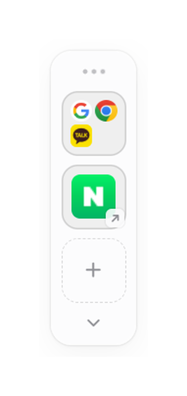
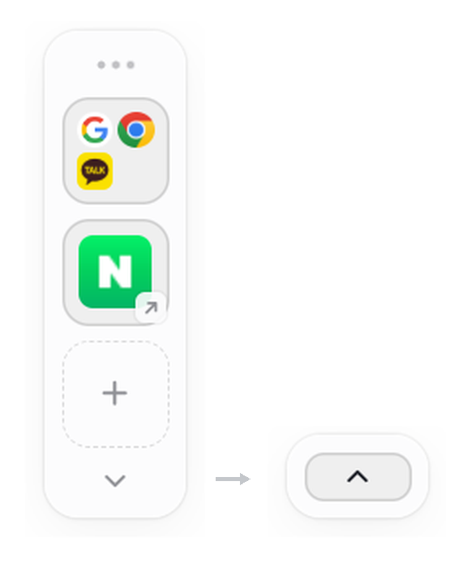
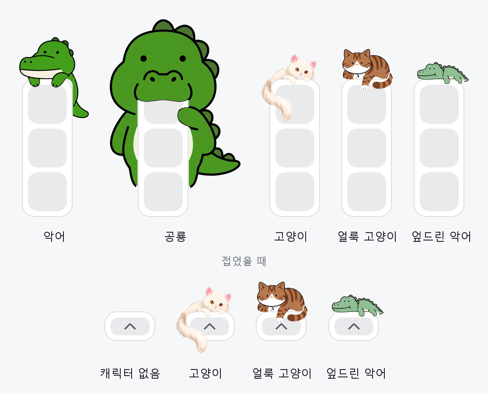

# Peek

화면 가장자리에 다섯 칸을 두고, 웹페이지와 프로그램과 파일과 폴더를 한 자리에서 엽니다.
Five slots at the edge of your screen. Open web pages, programs, files and folders from one place.

[한국어](#한국어) · [English](#english)

이 저장소에는 설치 파일만 있습니다. 소스 코드는 공개하지 않습니다.
This repository holds installers only. The source code is not public.

---

## 한국어



매일 사용하는 프로그램과 웹페이지가 즐겨찾기, 바탕화면, 탐색기에 흩어져 있으면 찾는 데 시간이 걸립니다. Peek은 이것들을 화면 가장자리의 다섯 칸에 모아 둡니다.

### 여러 개를 한 번에 열기

자주 함께 사용하는 항목은 한 칸에 묶을 수 있습니다. 오른쪽 그림에서는 맨 위 칸에 지메일과 크롬과 메신저가 함께 들어 있습니다.

1. **한 칸에 모읍니다.** 아이콘을 다른 칸의 가운데로 끌어다 놓으면 두 항목이 하나로 묶입니다. 한 칸에 최대 4개까지 넣을 수 있습니다.
2. **한 번 클릭하면 모두 실행됩니다.** 묶인 칸을 클릭하면 안에 있는 항목이 전부 열립니다.
3. **단축키를 지정할 수 있습니다.** 묶인 칸을 마우스 오른쪽 버튼으로 클릭한 뒤 단축키 걸기를 선택하고 원하는 글자를 누릅니다. Ctrl + Alt가 자동으로 붙습니다.

두 번째 칸에는 웹 주소가 등록되어 있습니다. 웹 주소를 등록하면 해당 사이트의 아이콘이 자동으로 표시됩니다.

<br clear="right">

### 다운로드

[Releases](../../releases) 에서 최신 버전을 받을 수 있습니다.

| 운영체제 | 파일 | 요구 사항 |
|---|---|---|
| 윈도우 | `Peek_x.y.z_x64-setup.exe` | 윈도우 10 이상, 64비트 |
| 맥 | `Peek_x.y.z_universal.dmg` | 애플 실리콘과 인텔 모두 |

### 설치

**윈도우.** 설치 파일을 실행하면 "게시자를 알 수 없습니다"라는 경고가 표시됩니다. 코드 서명을 하지 않은 개인 제작 프로그램이기 때문입니다. 추가 정보를 클릭한 뒤 실행을 선택하면 설치가 진행됩니다.

**맥.** dmg 파일을 열어 Peek을 응용 프로그램 폴더로 옮깁니다. 그다음 아이콘을 마우스 오른쪽 버튼으로 클릭하고 열기를 선택합니다. 더블클릭으로는 실행되지 않습니다. 서명과 공증을 거치지 않았기 때문입니다. 그래도 실행되지 않으면 터미널에서 `xattr -cr /Applications/Peek.app` 명령을 한 번 실행합니다.

설치가 끝나면 사용법 창이 한 번 표시됩니다. 이후에는 트레이 아이콘에서 다시 열 수 있습니다. 새 버전을 덮어 설치해도 등록해 둔 다섯 칸은 그대로 유지됩니다.

### 등록하기와 정리하기

**등록하기.** 웹페이지와 프로그램과 폴더를 칸으로 끌어다 놓으면 등록됩니다. 브라우저 주소창의 링크를 끌어와도 됩니다. 빈 칸을 클릭해 주소나 경로를 직접 입력할 수도 있습니다.

**접기.** 아래쪽 화살표를 클릭하면 위젯이 접힙니다. 너비는 그대로 두고 아래쪽 한 줄만 남습니다. 평소에 열고 닫는 방법입니다.



**한꺼번에 감추기.** 윈도우에서는 윈도우 키와 D를 함께 누르면 다른 창과 함께 접히고, 다시 누르면 같이 돌아옵니다. 화면을 공유하거나 옆에서 누가 볼 때처럼 바탕화면만 남기고 싶은 순간에, 위젯만 따로 치울 필요가 없습니다.

**옮기기와 순서 바꾸기.** 점 세 개를 끌면 위젯을 옮길 수 있으며 화면 가장자리에 자동으로 붙습니다. 칸을 끌어 다른 칸의 위나 아래에 놓으면 순서가 바뀝니다.

### 그 밖의 기능

| 조작 | 기능 |
|---|---|
| 칸을 오른쪽 버튼으로 클릭 | 이름과 주소 수정 |
| 칸 위에 마우스 올리기 | 빨간색 X 버튼으로 삭제 |
| 패널을 오른쪽 버튼으로 클릭 | 테마, 색상, 언어, 캐릭터, 자동 실행, 사용법, 종료 |
| 트레이 아이콘 | 위젯 표시, 화면 중앙으로 이동, 사용법, 종료 |

모든 설정은 패널을 오른쪽 버튼으로 클릭하면 나오는 메뉴에 있습니다. 항목을 선택해도 메뉴가 닫히지 않기 때문에 여러 설정을 차례로 바꿔 볼 수 있습니다.

색상은 메뉴 가운데에 있는 여섯 개의 점에서 고릅니다. 기본, 핑크, 파랑, 초록, 보라, 모래 중에서 선택할 수 있습니다. 선택한 색상에 맞춰 밝은 화면과 어두운 화면의 색이 각각 계산됩니다.

한국어와 영어를 지원합니다. 운영체제의 언어 설정을 따라가며, 메뉴에서 하나로 고정할 수도 있습니다.

위젯의 위치를 찾지 못할 때는 트레이 아이콘에서 화면 중앙으로 이동을 선택합니다.

다른 프로그램에서 Peek을 호출할 때는 아래 주소를 사용합니다. Peek이 실행 중이 아니면 자동으로 실행되며, 등록해 둔 이름과 정확히 일치해야 합니다.

```
peek://open/<칸 또는 묶음의 이름>
```

### 캐릭터

부가 기능입니다. 다섯 개의 캐릭터 중 하나를 위젯 위에 표시할 수 있으며, 캐릭터는 이따금 움직입니다. 기본값은 캐릭터를 표시하지 않는 것입니다.



위젯을 접으면 악어와 공룡은 함께 사라집니다. 고양이, 얼룩 고양이, 엎드린 악어는 접은 뒤에도 그림처럼 남아 있습니다.

### 개인 정보

등록한 주소와 사용 기록은 사용자의 컴퓨터 밖으로 전송되지 않습니다. 계정도 서버 동기화도 없습니다. 외부와 통신하는 경우는 두 가지입니다. 웹 주소의 아이콘을 가져올 때와, 새 버전이 나왔는지 확인할 때입니다. 두 경우 모두 요청만 보낼 뿐, 외부로 나가는 데이터는 없습니다.

설정은 아래 파일 한 개에만 저장됩니다.

```
윈도우  %APPDATA%\dev.jmelodycat.peekwidget\config.json
맥      ~/Library/Application Support/dev.jmelodycat.peekwidget/config.json
```

이 파일에는 등록한 다섯 칸과 위젯 위치, 테마와 색, 언어, 캐릭터, 자동 실행 여부가 들어 있습니다. 각 칸을 몇 번 열었는지와 위젯을 접은 날짜도 함께 적힙니다. 다른 컴퓨터로 옮기려면 같은 경로에 이 파일을 복사합니다. 웹 주소는 그대로 열리지만 프로그램과 폴더는 경로가 같아야 열립니다.

### 삭제

윈도우에서는 설정 > 앱 > 설치된 앱에서 Peek을 제거합니다. 맥에서는 응용 프로그램 폴더에서 Peek.app을 삭제합니다. 설정 파일은 위 경로에 남으므로 필요하면 해당 폴더도 함께 삭제합니다.

### 문의

버그나 불편한 점은 [Issues](../../issues) 에 남겨 주세요. 개인이 만든 프로그램이라 답변이 늦을 수 있습니다.

---

## English


The programs and web pages you use every day are spread across bookmarks, the desktop and the file explorer. Finding them takes time. Peek collects them into five slots at the edge of your screen.

### Opening several items at once

Items you always use together can be placed in a single slot. In the picture on the right, the top slot holds Gmail, Chrome and a messenger.

1. **Put them in one slot.** Drag an icon onto the center of another slot to combine the two. A slot holds up to four items.
2. **One click opens them all.** Clicking a combined slot launches every item inside it.
3. **Assign a shortcut.** Right-click the combined slot, choose Set a shortcut and press a key. Ctrl + Alt is added automatically.

The second slot holds a web address. When you register a web address, the site's own icon is displayed automatically.

<br clear="right">

### Download

The latest version is available on the [Releases](../../releases) page.

| System | File | Requirements |
|---|---|---|
| Windows | `Peek_x.y.z_x64-setup.exe` | Windows 10 or later, 64-bit |
| macOS | `Peek_x.y.z_universal.dmg` | Apple silicon and Intel |

### Installation

**Windows.** The installer displays an "unknown publisher" warning because the program is not code signed. Click More info and then Run to continue.

**macOS.** Open the dmg file and move Peek to the Applications folder. Then right-click the icon and choose Open. Double-clicking will not work, because the app is neither signed nor notarised. If it still refuses to open, run `xattr -cr /Applications/Peek.app` once in Terminal.

The how-to window appears once after installation, and can be reopened from the tray icon. Installing a newer version over an older one keeps the slots you have already set up.

### Registering and tidying

**Registering.** Drag web pages, programs and folders onto a slot to register them. Links dragged from a browser address bar also work. You can also click an empty slot and type an address or a path.

**Folding.** Clicking the arrow at the bottom folds the widget. The width stays the same and only the bottom row remains. This is the everyday way to open and close it.


**Hiding it with everything else.** On Windows, pressing the Windows key and D folds Peek together with your other windows, and pressing it again brings them all back. When you are sharing your screen or someone is looking over your shoulder, you do not have to put the widget away separately.

**Moving and reordering.** Dragging the three dots moves the widget, which then snaps to the edge of the screen. Dragging a slot above or below another slot changes the order.

### Other features

| Action | Function |
|---|---|
| Right-click a slot | Edit its name and address |
| Hover over a slot | Delete with the red X button |
| Right-click the panel | Theme, color, language, character, start-up, how to use, quit |
| Tray icon | Show widget, move to center, how to use, quit |

All settings are in the menu that appears when you right-click the panel. The menu stays open after you select an item, so you can change several settings in turn.

Colors are chosen from the six dots in the middle of the menu: default, pink, blue, green, violet and sand. Light and dark variants are calculated separately from the color you select.

Korean and English are supported. Peek follows your system language, and you can fix it to one language from the menu.

If you cannot find the widget, choose Move to center from the tray icon.

Other programs can call Peek using the address below. Peek starts automatically if it is not running, and the name must match exactly.

```
peek://open/<name of the slot or group>
```

### Characters

An optional feature. One of five characters can be displayed on the widget, and the character moves from time to time. By default no character is shown.


When the widget is folded, the crocodile and the dinosaur disappear with it. The cat, the tabby and the resting crocodile remain visible.

### Privacy

The addresses you register and your usage history are never sent outside your computer. There is no account and no server synchronization. Peek connects to the network in two cases: to fetch the icon for a web address, and to check whether a newer version exists. Neither request sends any data about you.

Settings are stored in a single file.

```
Windows  %APPDATA%\dev.jmelodycat.peekwidget\config.json
macOS    ~/Library/Application Support/dev.jmelodycat.peekwidget/config.json
```

This file holds the five slots you registered, the widget position, the theme and color, the language, the character and whether Peek starts at login. It also records how many times each slot has been opened and the dates the widget was folded. To move your setup to another computer, copy this file to the same path. Web addresses open as before, but programs and folders only open if they sit at the same path on the new computer.

### Uninstalling

On Windows, remove Peek from Settings > Apps > Installed apps. On macOS, delete Peek.app from the Applications folder. The settings file remains at the path above, so delete that folder as well if required.

### Feedback

Please report bugs and problems on the [Issues](../../issues) page. Peek is made by one person, so replies may be slow.
